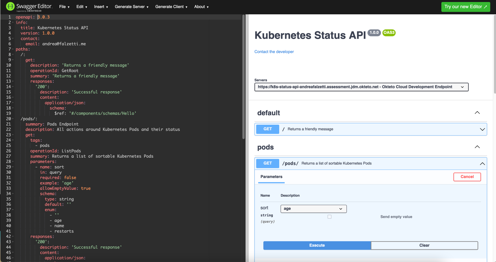

# Kubernetes Status API

> This project is intended as an exercise.

## Description

This repo contains an HTTP API service that expose the status of a Kubernetes cluster.



## Considerations

- I will be using [Go](https://go.dev/). Go is a good choice when it comes to build backend services thanks to its type-safety and rich ecosystem of modules that will help me in this project. Also, the Kubernetes client is very DevX friendly to use in Go.

- To implement the HTTP web server and also to keep the project structure well organized easily extensible in the future, I will be using [Gin](https://github.com/gin-gonic/gin).

- For Kubernetes I will be using [Okteto Cloud](https://www.okteto.com/). The service will run inside the Kubernetes cluster itself. If the code run elsewhere, some changes are required to retrieve the K8S's config.

- I will be using [OpenAPI](https://www.openapis.org/) and [{json:api}](https://jsonapi.org/) to define the API specs and data structure

## Development

### Using a CDE (Gitpod.io)

Launching the project in Gitpod will automatically connect to your Okteto cluster. Add the following env vars in your [Gitpod vars](https://gitpod.io/user/variables):

- `OKTETO_KUBECONFIG`: get this from the Okteto UI or CLI, and encode it in base64
- `OKTETO_TOKEN`: get this from the Okteto UI

Make sure to set a strict scope to avoid leaking the variables.

### Requirements

As requirement to run this, you need a Kubernetes cluster. In my case I am using Okteto Cloud. Check out [their Go sample project](https://www.okteto.com/docs/samples/golang/) to know more about Okteto.

To launch the project in Okteto, follow these steps:

1. Get the [Okteto CLI](https://www.okteto.com/docs/getting-started/#installing-okteto-cli)
1. `okteto context use https://<YOUR_NAMESPACE>.okteto.net`
1. `okteto deploy --build`
1. `okteto up`

### Testing

Run `make test` to execute the unit tests

### Publish to Docker

This step is only required in case the development image for Okteto needs some changes.

```bash
make docker-publish TAG=1.0.0
```

### Future improvements

This is just an exercise so it doesn't come with lot of production-ready stuff :)

These are some of the things I would consider do, to make it closer to be production-ready.

- [ ] Use the [./openapi.yml specs](./openapi.yml) for request/response validation and potentially for code generation
- [ ] Add error rate and latency alerts or SLOs
- [ ] Setup a CI/CD pipeline
- [ ] Consider introducing API versioning (e.g /v1)
- [ ] Add semantic versioning of the service
- [ ] Consider how to protect the API (ie. auth)

## Considerations

This project was quite fun to build and it was the first time for me integrating with the Kubernetes API so I had to learn how to do it.

In terms of testing, I've added some essential unit tests to:
    - validate the sorting logic
    - validate the integration with the kubernetes's API using the provided mock client

## Useful links

I've encountered a couple of useful blog posts that I've used to accomplish this exercise:

- https://betterprogramming.pub/build-a-scalable-api-in-go-with-gin-131af7f780c0
- https://medium.com/the-phi/mocking-the-kubernetes-client-in-go-for-unit-testing-ddae65c4302
